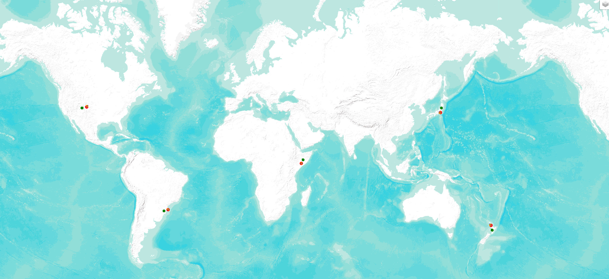

# Sentinel Data Download Tool

A simple tool to explore Sentinel-2 data for cities and download Sentinel-2 tiles.

## Prerequisites

- Python 3.6 or higher
- Required Python packages: see `requirements.txt`

## Installation

1. Clone or download this repository.

2. Install the required packages:

   Make the script executable:

  ```bash
  chmod +x ./installation/install_package.bash
  ```
  Run the script:

  ```bash
  ./installation/install_package.bash
  ```
3. Make the scripts executable:
```bash
chmod +x scripts/*.py
```

[More information about installation](./installation/install.md)
## Authentication

To download tiles, you need a valid Copernicus Data Space API token:

1. Register for an account at [Copernicus Data Space Ecosystem](https://dataspace.copernicus.eu/)
2. Generate a token using the token manager:
   ```bash
   python scripts/generate_token.py
   ```
   This will prompt you for your Copernicus username and password and save the token.
3. The scripts will automatically refresh the token when needed during execution

## Main Scripts

### 1. Land Polygons Download (`scripts/download_land_polygons.py`)

This script downloads Natural Earth land polygons at 1:110m scale, which are used to determine if points are on land or water.

#### Basic Usage

```bash
python scripts/download_land_polygons.py
```

#### Key Arguments

- `--output-dir`: Directory to save output files (default: "data")

The script will download the land polygons to the `data` directory in your project root.

### 2. City Explorer (`scripts/sentinel_city_explorer.py`)

This script queries Sentinel-2 Global Mosaics data for cities.

#### Basic Usage

```bash
python scripts/sentinel_city_explorer.py --cities-csv worldcities.csv --num-cities 5
```

#### Key Arguments

- `--cities-csv`: Path to the CSV file containing city data (required)
- `--num-cities`: Number of cities to select (default: 20)
- `--population-min`: Minimum population threshold for cities (default: 500000)
- `--output-dir`: Directory to save output files (default: "results")
- `--year-filter`: Year to filter for (default: "2023", min 2015)
- `--random-distance`: Distance in kilometers for random points from cities (default: 300)
- `--ensure-on-land`: Only generate random points on land (default: True)
- `--max-land-attempts`: Maximum attempts to find a random point on land (default: 10)
- `--min-city-distance`: Minimum distance between cities in kilometers (default: 500)
- `--random-seed`: Random seed for reproducible results (default: None)

#### Output

- A CSV file with the selected cities
- JSON files with the query results

### 3. Tile Downloader (`scripts/download_from_json.py`)

This script downloads Sentinel-2 tiles from JSON files generated by the city explorer.

#### Basic Usage

```bash
python scripts/download_from_json.py --json-file results/your_generated_file.json --output-dir downloads
```

#### Key Arguments

- `--json-file`: Path to the JSON file containing tile information (required)
- `--output-dir`: Directory to save downloaded files (default: "downloads")

### 4. Map Visualizer (`scripts/visualize_quarterly_products.py`)

This script creates an interactive map to visualize Sentinel-2 Global Mosaics quarterly products and their footprints.

#### Basic Usage

```bash
python scripts/visualize_quarterly_products.py --input-json results/your_generated_file.json --output-map maps/quarterly_products_map.html
```

#### Key Arguments

- `--input-json`: Path to the JSON file containing quarterly products (required)
- `--output-map`: Path to save the HTML map file (default: "maps/quarterly_products_map.html")

This an example of the map you can have with 5 cities : 


## Example Workflow

1. Download land polygons (if not already downloaded):
   ```bash
   python scripts/download_land_polygons.py
   ```

   This is the directory data you will have :

   ```bash
   ├── ne_110m_land.cpg
   ├── ne_110m_land.dbf
   ├── ne_110m_land.prj
   ├── ne_110m_land.README.html
   ├── ne_110m_land.shp
   ├── ne_110m_land.shx
   └── ne_110m_land.VERSION.txt
   ```

2. Run the city explorer to find Sentinel-2 data:
   ```bash
   python scripts/sentinel_city_explorer.py --cities-csv worldcities.csv --num-cities 3
   ```

3. Use the output JSON file to download the tiles:
   ```bash
   python scripts/download_from_json.py --json-file results/S2_GlobalMosaics_2023_unified_[timestamp].json --output-dir downloads
   ```

4. Visualize the results:
   ```bash
   python scripts/visualize_quarterly_products.py --input-json results/S2_GlobalMosaics_2023_unified_[timestamp].json
   ```

## Project Structure

```
.
├── data/                   # Downloaded land polygons and other data
├── downloads/             # Downloaded Sentinel-2 tiles
├── maps/                  # Generated visualization maps
├── results/              # Generated JSON files and selected cities CSV
├── scripts/              # All Python scripts
│   ├── download_land_polygons.py
│   ├── download_from_json.py
│   ├── sentinel_city_explorer.py
│   └── visualize_quarterly_products.py
└── src/                  # Source code modules
    ├── city_selector.py
    ├── map_visualizer.py
    ├── sentinel_query.py
    ├── sentinel_tile_downloader.py
    └── token_manager.py
```

## License

This project is open source and available under the MIT License. 